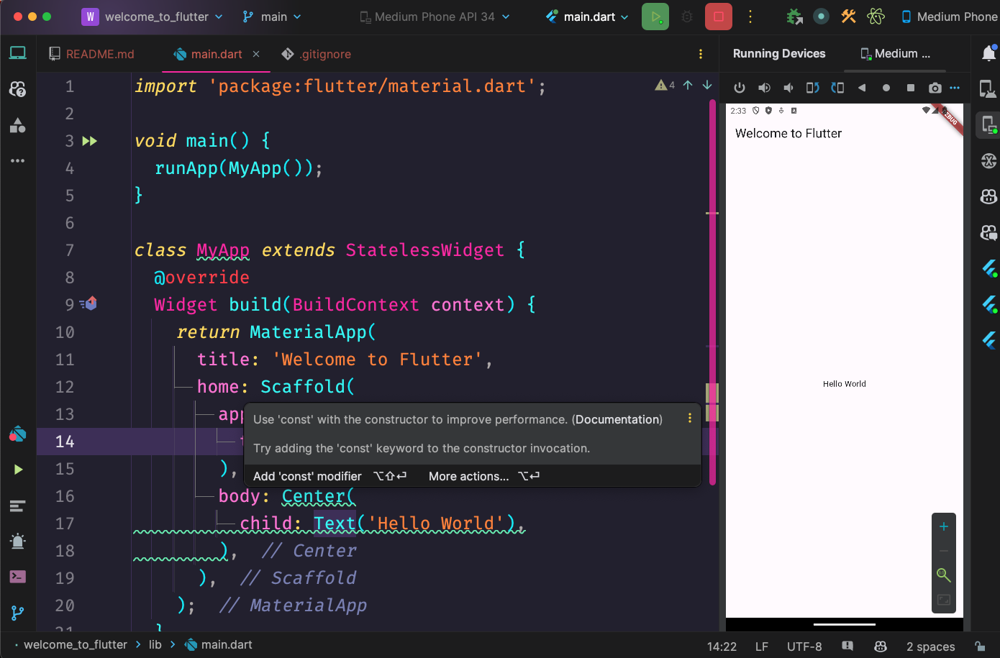

# Bienvenido a Flutter

Esta aplicación Flutter muestra un simple mensaje "Hola Mundo" en el centro de la pantalla. Sirve como una introducción básica al desarrollo con Flutter y proporciona un punto de partida para construir aplicaciones más complejas.

## Capturas de Pantalla

## Cómo Ejecutar

Para ejecutar esta aplicación Flutter, sigue estos pasos:

1. Asegúrate de tener Flutter instalado en tu sistema. Si no lo tienes, consulta la documentación oficial de Flutter para obtener instrucciones de instalación.
2. Clona este repositorio en tu máquina local.
3. Abre el proyecto en tu IDE o editor de texto preferido.
4. Conecta tu dispositivo o emulador.
5. Ejecuta el proyecto utilizando el comando `flutter run`.

## Retroalimentación

Si tienes algún comentario o sugerencia, no dudes en abrir un issue o crear un pull request. ¡Agradecemos las contribuciones de la comunidad!

## Licencia

Este proyecto está licenciado bajo la [Licencia MIT](LICENSE).
